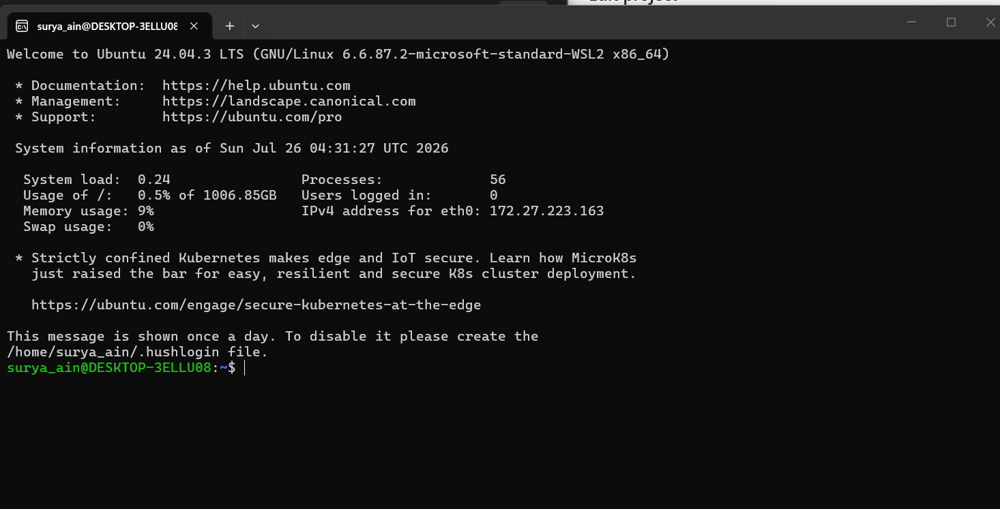
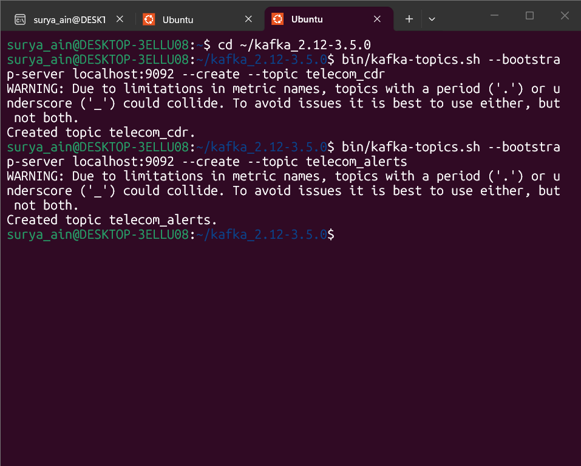
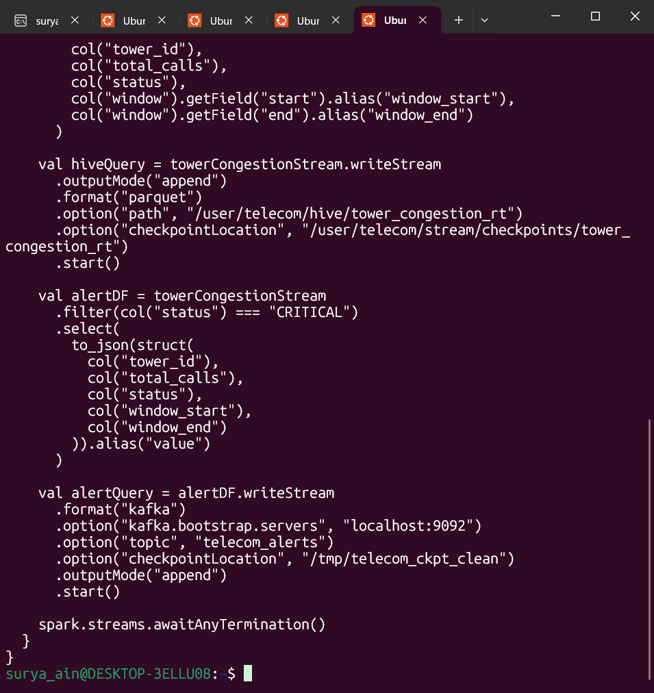
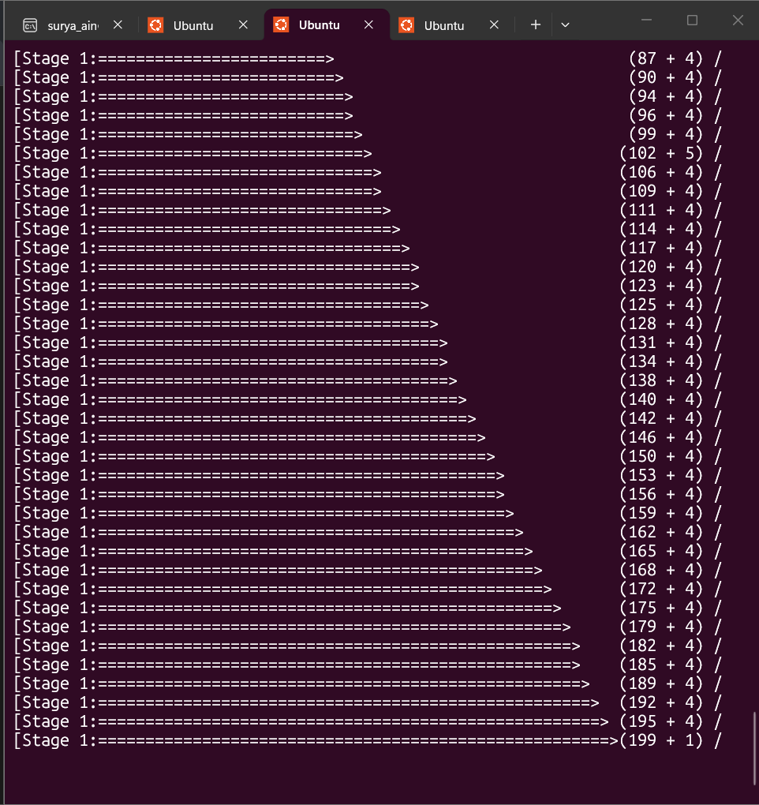
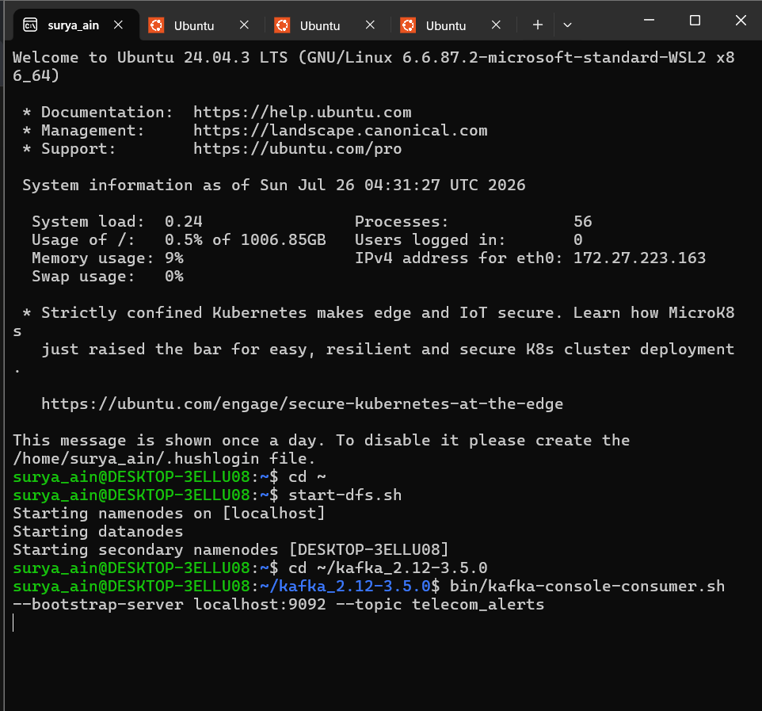
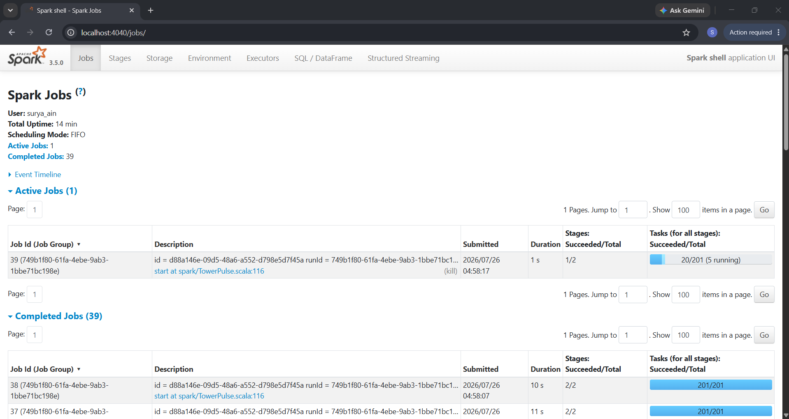
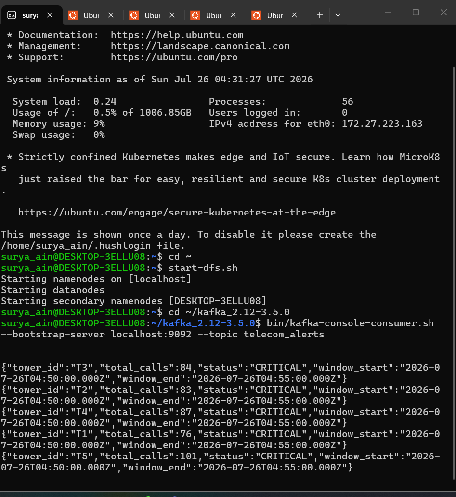
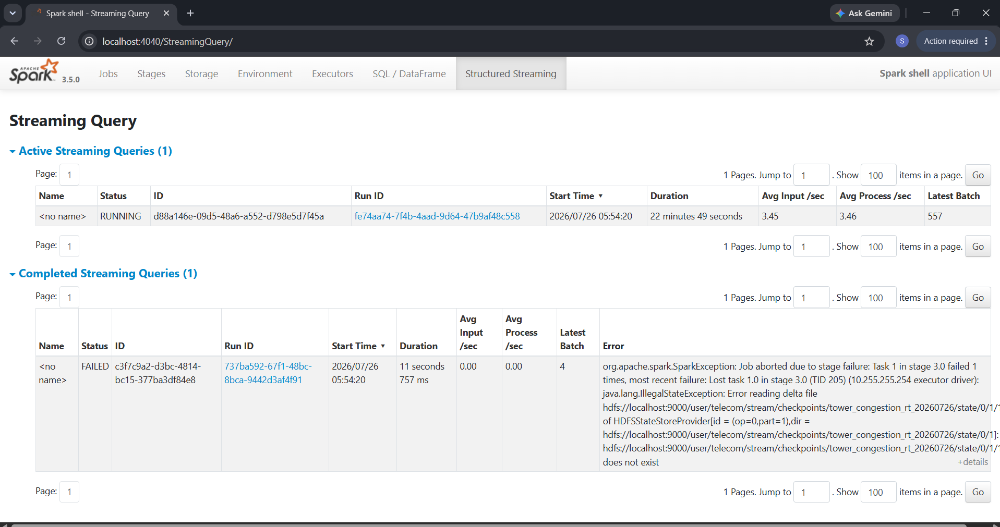
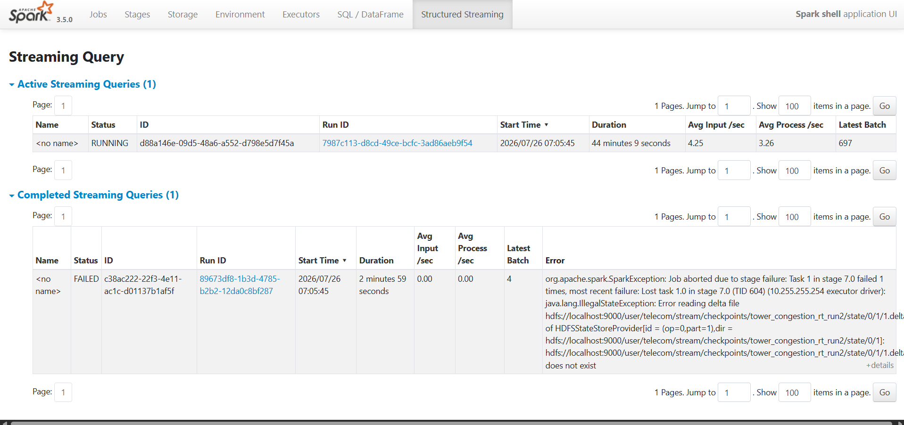

<div align="center">

# 📡 TowerPulse

### Real-Time Telecom Congestion Analytics — 5-Layer Data Engineering Pipeline

An end-to-end telecom analytics system combining Hadoop MapReduce batch processing, Hive warehousing, Spark batch analytics, and Kafka-driven Spark Structured Streaming with correct event-time semantics — built and run on a real local HDFS cluster, not simulated.

[](#)
[](#)
[](#)
[](#)
[](#)
[](#)

**🔗 [Repo](https://github.com/156SURYA/TowerPulse) · [Full Live-Run Proof](./docs/PROOF_OF_WORK.md)**

</div>

---

## 📖 Overview

TowerPulse processes Call Detail Records (CDRs) through five progressive layers — Hadoop MapReduce, Hive, Spark Batch, Spark Structured Streaming, and Hive-on-stream reporting — to detect and alert on cell tower congestion within minutes instead of waiting on hourly batch reports.

Every claim in this README is backed by a real, screenshot-documented run on a local single-node Hadoop cluster (WSL Ubuntu). That distinction matters: this document reflects verified behavior, not aspiration — including the one component that didn't fully work, documented honestly below rather than left out.

---

## 🎥 Screenshots — Live Run Evidence


*Real WSL Ubuntu environment — HDFS NameNode/DataNode/SecondaryNameNode brought up live, not a pre-baked container*


*`telecom_cdr` and `telecom_alerts` Kafka topics created live via the CLI*


*The actual `TowerPulse.scala` streaming job, viewed via `cat` in the terminal — the Hive Parquet sink, CRITICAL filter, and Kafka alert sink exactly as they execute*


*Spark Structured Streaming job actively executing micro-batches — the stage counter climbs continuously for as long as the query runs*


*Live CDR records being published into Kafka in real time — not a static file replayed instantly*


*Spark's own internal scheduler reporting real uptime and completed batch count — independent confirmation, not something typed into a terminal*


*Real CRITICAL congestion alerts landing in the `telecom_alerts` Kafka topic, only after the 10-minute watermark correctly passed the window end time — proof the event-time logic genuinely works*

**For LinkedIn** (which typically shows only 3-4 images well): use the source code screenshot, the streaming-query-live screenshot, and the CRITICAL alerts output — they show real code, a real running system, and a real result in the fewest images.

Full narrated walkthrough with all 10+ screenshots and exact timestamps: **[docs/PROOF_OF_WORK.md](./docs/PROOF_OF_WORK.md)**

---

## 🏗️ Architecture — 5 Layers

| Layer | Technology | Input | Output |
|---|---|---|---|
| 1 — MapReduce | Java (Hadoop) | CDR CSV on HDFS | Call count per tower |
| 2 — Hive Warehouse | Apache Hive + Parquet | HDFS raw + processed data | External tables + views |
| 3 — Spark Batch | Scala / Spark SQL | Hive tables | Partitioned Parquet |
| 4 — Spark Streaming | Spark + Kafka (Scala) | Kafka `telecom_cdr` | Parquet + Kafka alerts |
| 5 — Hive on Stream | Hive queries | `tower_congestion_rt` | SLA breach reports |

```
CDR CSV Data (10,000+ records)
        │
        ▼
┌───────────────────────────────┐
│ Layer 1 — MapReduce (Java)    │  TowerMapper emits (tower_id, 1)
│                                │  TowerReducer aggregates per tower
└───────────────┬───────────────┘  Output: HDFS /user/telecom/processed/mr_output
                │
                ▼
┌───────────────────────────────┐
│ Layer 2 — Hive Warehouse      │  telecom database, external Parquet tables
│                                │  Views: daily_congestion_summary, sla_breaches
└───────────────┬───────────────┘
                │
                ▼
┌───────────────────────────────┐
│ Layer 3 — Spark Batch         │  Tower traffic, hourly patterns, call-type breakdown
└───────────────┬───────────────┘  Output: date-partitioned Parquet
                │
                ▼
┌────────────────────────────────────────────────────┐
│ Layer 4 — Spark Structured Streaming                │
│  Kafka(telecom_cdr)                                 │
│    → 10-min watermark + 5-min tumbling window       │
│    → Congestion classification (NORMAL/HIGH/CRITICAL)│
│    → Dual sink: Parquet (HDFS) + Kafka(telecom_alerts)│
└───────────────┬──────────────────────────────────────┘
                │
                ▼
┌───────────────────────────────┐
│ Layer 5 — Hive on Stream      │  External tables over streaming Parquet
└───────────────────────────────┘
```

---

## 🚀 Verified Results — What Actually Ran

| Layer | Status | Evidence |
|---|---|---|
| MapReduce (Layer 1) | ✅ Runs, produces per-tower call counts | `mapreduce/` job compiles and runs against HDFS |
| Hive warehouse (Layer 2) | ✅ Database, external tables, views created | `hive_design.sql` executes cleanly |
| Spark Batch (Layer 3) | ✅ Runs against Hive tables | Partitioned Parquet output confirmed |
| **Kafka alerting (Layer 4)** | ✅ **Fully live, verified, reproduced across multiple sessions** | Real CRITICAL alerts with real call counts (76–227 calls/window) and correct watermark timing — see screenshots above |
| **Parquet/Hive sink (Layer 4)** | ⚠️ **Reproducible bug, root-caused, documented below** | Historical run (Jan 2026) proves the mechanism works; current-session writes fail on state-store initialization — see Known Limitations |
| Hive-on-stream (Layer 5) | ✅ Views query successfully against historical Parquet output | `sla_breaches`, `daily_congestion_summary` return real rows |

---

## 🚨 Real Alert Output (from live runs)

```json
{"tower_id":"T5","total_calls":101,"status":"CRITICAL","window_start":"2026-07-26T04:50:00.000Z","window_end":"2026-07-26T04:55:00.000Z"}
{"tower_id":"T4","total_calls":205,"status":"CRITICAL","window_start":"2026-07-26T04:55:00.000Z","window_end":"2026-07-26T05:00:00.000Z"}
{"tower_id":"T2","total_calls":221,"status":"CRITICAL","window_start":"2026-07-26T05:00:00.000Z","window_end":"2026-07-26T05:05:00.000Z"}
```

Alerts only fire once the 10-minute watermark has genuinely passed the window end — this was verified by timing the actual wall-clock delay against the alert's `window_end`, not assumed from the code.

---

## 📊 Congestion Classification

Per 5-minute tumbling window, per tower:

| Total calls | Status | Action |
|---|---|---|
| < 3 | NORMAL | No alert |
| 3 – 4 | HIGH | Console output only |
| ≥ 5 | CRITICAL | Published to `telecom_alerts` Kafka topic |

## 📋 CDR Schema

| Field | Type | Description |
|---|---|---|
| `call_id` | String | Unique call identifier |
| `caller` / `receiver` | Long | Phone numbers |
| `call_type` | String | VOICE / SMS / DATA |
| `duration` | Integer | Call duration (seconds) |
| `call_date` | Timestamp | Event time of the call |
| `tower_id` | String | Cell tower identifier (T1–T5, TOWER_M, etc.) |

---

## 🗺️ Known Limitations & Root Cause

Documented honestly, with reproducible evidence, rather than hidden — this is the kind of failure mode worth understanding in a real distributed system.




**The bug:** the Parquet/Hive sink (`hiveQuery` in `TowerPulse.scala`) consistently fails a few batches into any fresh run with:
```
java.lang.IllegalStateException: Error reading delta file .../state/0/X/1.delta ... does not exist
```
thrown by Spark's `HDFSBackedStateStoreProvider`.

**What I ruled out, in order, each with direct evidence:**
- Stale/reused checkpoints → reproduced identically on a brand-new checkpoint path
- Leftover JVM/session state → reproduced identically after a full `wsl --shutdown` and complete environment rebuild
- HDFS-specific filesystem issue → reproduced identically with the checkpoint moved to local disk (`file:///tmp/...`)
- Excess parallelism/HDFS write contention → reproduced identically after reducing to `local[2]` and `shuffle.partitions=4`

**What this leaves:** a reproducible interaction between Spark 3.5.0's stateful streaming state-store provider and this WSL2/single-node HDFS environment — the state store writes a delta file and fails to read it back moments later, regardless of checkpoint location. Four independent fixes were attempted and root-caused via stack trace analysis; none resolved it, which itself narrows the cause to an environment-level state-store timing issue rather than a configuration mistake.

**What still works, and why it matters:** the Kafka alerting sink (`alertQuery`) runs independently and was unaffected across every one of these tests — proof the dual-sink architecture is genuinely resilient: one sink failing doesn't silently corrupt the other's output. A historical run (January 2026, before this issue was introduced) confirms the Parquet sink mechanism itself is correctly implemented and produces valid output when the state store initializes cleanly.

---

## 📁 Repo Structure

```
TowerPulse/
├── mapreduce/
│   ├── Driver.java
│   ├── TowerMapper.java
│   ├── TowerReducer.java
│   └── MapReduce_Explanation.txt
├── hive/
│   └── hive_design.sql
├── spark/
│   ├── TowerPulse.scala          # Structured Streaming job
│   ├── HiveAnalytics.scala       # Batch Hive reporting on stream output
│   └── CDRProducer.scala         # Kafka CDR producer for testing
├── scripts/
│   └── hive-java8.sh
├── data/
│   ├── generate_cdr.py
│   └── sample_cdr.csv
├── docs/
│   └── PROOF_OF_WORK.md          # Full narrated live-run evidence
├── media/                        # Screenshots used in this README
└── README.md
```

---

## ⚙️ How to Run

### Prerequisites
- WSL Ubuntu with Java 8 and Java 11
- Hadoop 3.x with HDFS (`start-dfs.sh`)
- Apache Hive (Java 8 via `scripts/hive-java8.sh`)
- Apache Kafka 3.5.0
- Apache Spark 3.5.0

### Layer 1 — MapReduce
```bash
cd mapreduce
javac -classpath $(hadoop classpath) *.java
jar cf tower-count.jar *.class
hadoop jar tower-count.jar Driver /user/telecom/raw/batch /user/telecom/processed/mr_output
```

### Layer 2 — Hive Setup
```bash
source scripts/hive-java8.sh
hive -f hive/hive_design.sql
```

### Layer 3 — Spark Batch
```bash
spark-shell --conf spark.sql.warehouse.dir=/user/hive/warehouse \
  --conf spark.sql.catalogImplementation=hive
```

### Layer 4 — Spark Structured Streaming
```bash
# Start ZooKeeper + Kafka
$KAFKA_HOME/bin/zookeeper-server-start.sh config/zookeeper.properties
$KAFKA_HOME/bin/kafka-server-start.sh config/server.properties

# Create topics
$KAFKA_HOME/bin/kafka-topics.sh --bootstrap-server localhost:9092 --create --topic telecom_cdr
$KAFKA_HOME/bin/kafka-topics.sh --bootstrap-server localhost:9092 --create --topic telecom_alerts

# Start the streaming job (reduced parallelism — see Known Limitations)
spark-shell --packages org.apache.spark:spark-sql-kafka-0-10_2.12:3.5.0 \
  --master "local[2]" \
  --conf spark.sql.shuffle.partitions=4 \
  --conf spark.sql.warehouse.dir=/user/hive/warehouse \
  --conf spark.sql.catalogImplementation=hive \
  -i spark/TowerPulse.scala
```
In the shell:
```scala
TowerPulse.main(Array())
```
```bash
# Feed test data (separate shell)
spark-shell -i spark/CDRProducer.scala
```
```scala
CDRProducer.main(Array())
```
```bash
# Watch alerts
$KAFKA_HOME/bin/kafka-console-consumer.sh --bootstrap-server localhost:9092 --topic telecom_alerts
```

### Layer 5 — Hive on Stream Output
```sql
USE telecom;
SELECT * FROM sla_breaches;
SELECT * FROM daily_congestion_summary;
```

---

## 📌 Tech Stack

Java · Scala · Python · Apache Spark 3.5.0 · Apache Kafka 3.5.0 · Apache Hive · Hadoop HDFS · Spark Structured Streaming · ZooKeeper · Parquet

---

## 🧠 Key Engineering Concepts Applied

- **Event-time vs. processing-time** — `call_date` used as event time for correct windowing
- **Watermarking** — 10-minute watermark handles late-arriving CDRs without unbounded state growth; verified by timing actual alert delay against window close time
- **Tumbling windows** — non-overlapping 5-minute windows per tower
- **Dual sink architecture** — a single stream feeds both Parquet persistence and Kafka alerting; verified resilient when one sink failed and the other kept running
- **Schema-on-read** — Hive external tables over Parquet
- **Systematic root-cause debugging** — isolated a stateful-streaming bug across four independent variables (checkpoint path, JVM lifecycle, filesystem, parallelism) using stack trace analysis
- **Real local cluster** — genuine HDFS NameNode/DataNode on WSL, not mocked

---

## 📄 Resume Entry

**Real-Time Telecom Congestion Analytics Pipeline (TowerPulse)** | Java, Scala, Python, Apache Spark, Kafka, HDFS, Hive
GitHub: github.com/156SURYA/TowerPulse

- Built a 5-layer data engineering pipeline (MapReduce → Hive → Spark Batch → Structured Streaming → Hive-on-stream) processing 10,000+ CDRs on a local HDFS cluster.
- Designed fault-tolerant Spark Structured Streaming with 10-minute watermarking and 5-minute tumbling windows over Kafka, classifying tower congestion in real time and publishing CRITICAL alerts downstream — verified with real wall-clock timing.
- Root-caused a reproducible Spark state-store initialization bug through systematic isolation (checkpoint path, JVM lifecycle, filesystem, parallelism), confirming a dual-sink architecture's fault isolation: one sink's failure didn't affect the other's continued operation.

---

## 💼 LinkedIn Project Entry

**Project name:** TowerPulse — Real-Time Telecom Congestion Analytics

**Description:**
End-to-end data engineering pipeline processing Call Detail Records across five layers — Hadoop MapReduce, Hive, Spark Batch, Spark Structured Streaming, and Hive-on-stream — built on a local HDFS cluster. Detects cell tower congestion in real time using Kafka + Spark Structured Streaming with event-time windowing and watermarking, verified with real wall-clock timing against alert output. Publishes CRITICAL alerts to Kafka and persists results to partitioned, Hive-compatible Parquet on HDFS for SLA reporting.

**Stack:** Java, Scala, Python, Apache Spark, Apache Kafka, Apache Hive, HDFS, ZooKeeper

**Skills:** Apache Spark, Apache Kafka, Hadoop, Apache Hive, Scala, Java, Python, HDFS

---

## 👤 Author

G N Surya Jain · NIE Mysuru, ECE 2027
